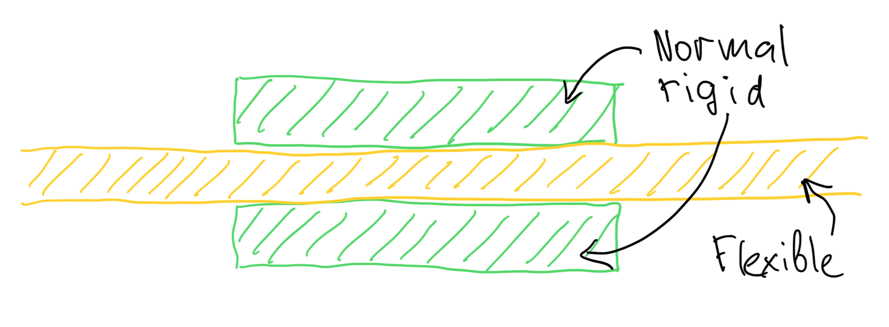

It took a while for me to find some information on the topic, and a bit of try and fail to figure out. So here is a bit of a write up for how it works and how to design rigid-flex PCBs in KiCad specifically.

Also, a bit of a warning. I have learned this the hard way, but turned out that rigid-flex PCBs are crazy expensive to manufacture. As in ~100x times more expensive than regular PCBs. So maybe think twice before committing to this path.

## What is rigid-flex

If you know what rigid-flex is skip this section, I just feel like some disambiguation could be useful here. Basically there are three types of PCBs most commonly used.

1. a *rigid* PCB - the most common every day PCB type made of sheer cancer
2. a *flex* PCB - is made of ubiquitous orange polyimide film with copper tracks
3. a *rigid-flex* PCB is basically a combination of the two some parts are flexible some rigid

The easiest way to think about it is this, first they make a *flex* PCB that covers the entirety of the combined PCB, and then they glue the rigid parts to it where needed, usually on both sides.

In it's basic form a *rigid-flex* PCB is sort of like a normal 4 layer PCB where the inner two layers are made of a *flex* PCB, and the outer two layers are basically one sided rigid PCBs glued to it where one needs the rigid parts

## How to design one in KiCad

This has turned out to be the easiest part actually. All one has to do is to set up a 4 layer PCB in the PCB config, and then design it as a normal 4 layer PCB with one exception. The outer front and back layer tracks should only be on the rigid parts and never cross into the flexible part.

Then one does a normal outline layer, and finally in the user notes, one has to mark out the flexible sections for the manufacturer. Basically free style it with any drawing tools available, just shade out the flexible parts. Also, it's a good idea to leave some text in that layer with explanations for the manufacturer what your markings mean.

When you submit your gerber file to a fab, a human will look into your design and they'll know what to do.

