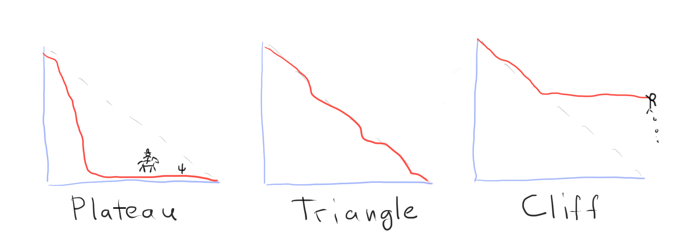

Overtime, while working in management, everyone picks up shortcuts for assessing
situations quickly. They are not meant to give one a comprehensive information
about what's going on, but they give a general idea that something doesn't quite
smell right.

After staring at burndown charts for years, I feel that I can tell the general
dynamics in a team and their processes struggles after looking at a few recent
burndown charts. If the chart looks like a plateau, hire a tech lead; if it
looks like a cliff hire a PO; if it looks like a triangle, leave the team alone
and go do something else.

Obviously, I'm not going to fire and hire anyone, that's not how management
works. And, I might actually have a completely wrong idea about what's going on.
But, at the same time, I know, that if there is something wrong with the
burndown charts, sprint after sprint consistently, there are usually reasons
that need investigation.

Today, I'm writing about one of those mental shortcuts and what's the thinking
behind it.

## Why burndown charts?

To be clear, I think there is nothing inherently superior about burndown charts.
All sorts of other tools could be used to quickly assess a team's health. If
anything, and if I hand to choose just one tool, I'd probably look at the
frequency of deployments as the most reliable indicator.

Burndown charts are quite ubiquitous though. They are readily available on most
platforms, and they're visual. I also think that burndown charts are a bit more
verbose than say the deployments frequency number. And finally, as a manager, I
would normally know the members of the team, their seniority, skill levels, etc.
So, when paired that with the burndown charts analysis, it gives me a pretty
decent idea where to start digging.

## Burndown patterns

Life is messy, and software engineers work in highly unpredictable, dynamically
evolving environments. Burndown charts, as a reflection of that process, are
never clean either. Even perfectly high performing teams occasionally produce
less than stellar charts.

Still, if you analyse a series of charts, there are consistent patterns. If you
think about it from the systems thinking perspective, then you know that systems
produce consistent behaviour because of their internal structure. Burndown
charts are a manifestation of a complex system behaviour, and there are usually
specific reasons why they look the way they do.

There are three main shapes that I personally look at when I analyse burndown
charts behaviour:

1. A **plateau** - work is finished significantly early
2. A **triangle** - work goes more or less according to a plan
3. A **cliff** - a significant carry over, or most work submitted as a bulk at
   the last minute

The **plateau** doesn't happen often on a consistent basis. It usually means
that everything is overestimated, which usually caused by a lack of seniority on
the team. This pattern also produced by new teams that are recalibrating, but it
doesn't persist over time.

The **triangle** pattern usually means the team does what it supposed to, just
leave them to do their work. Keep in mind that triangles are never perfect, they
often have small cliffs or plateaus in the last quarter of the graph, that's
perfectly normal.

The most telling pattern is the **cliff** and that's where you might want to get
involved as a manager. There are multiple specific situations that produce
cliffs, and that's what I'm going to go through in the rest of the post.

## Cliff type 1: chunky

This type of cliffs often look like the bulk of the work is submitted in the
last minute. Or sometimes it manifests as a series of smaller cliffs that look
like huge steps on the chart. The work is usually mostly done, occasionally with
a delay, but the graph looks chunky.

As the name implies the **chunky** cliff means that the team is not granular
enough in their estimations and planning. Tickets are often estimated in days
worth of effort. Hence when the items are delivered the are represented as big
drops on the chart.

When you see a chunky graph, it doesn't necessarily mean lack of skill in
process and/or technology within the team. But, it does usually signify that the
team is playing the game conservatively. In a way it is the overestimation
coping behaviour, just in a different format: the team does a rather shallow
planning to be on the safe side.

There are usually a few possible reasons for this. Either the team members were
never taught effective planning techniques. Or there is a lack of trust between
product and engineering, which results in engineers not having enough insight
into the problem, or not having enough time to do the proper investigation and
planning. In the end of the planning session, the work just roughly shovelled
into large buckets and off they go.

## Cliff type 2: the wall

This type of cliffs often looks like the chunky cliff, but it might look like a
cliff hanger too (see below). The reason why it's a separate type is that it has
a different kind of a problem underneath. In this case the process is at fault.

The **wall** in this instance refers to that mythical wall over which work is
often thrown. And it usually works like so. Work is dutifully estimated, and
then generously padded because those pesky QA people -- who either sit quietly
in the corner, or not even present in the meeting -- love to throw the work back
over the wall. Sometimes that is a PO playing the QA role. And sometimes, in
more old fashioned teams where development and delivery are separate, you might
see the wall between the devs and ops, with pretty much the same patten of the
system behaviour.

Engineers write code, throw it over the wall to QA and move on. An hour later QA
throws it back over the wall marked as faulty. And this volleyball match
begrudgingly drags for days. Everyone dutifully "just doing their work".

The problems is usually the same every time, the lack of actually
cross-functional work. A team might nominally be cross-functional and agile, but
they'd work on a waterfall in a miniature basis on the inside. And those walls
manifest in the charts as chunky drops.

## Cliff type 3: the cliff hanger

This type of cliffs happen when there is a significant amount of carry over into
the next sprint. Often times it is accompanied by an all out crunch time by the
team at the end of each sprint.

I call it a **cliff hanger** because there is usually very little predictability
into how much work will actually make it into the sprint deliverables. It's
always a coin toss away. Two things are consistently predictable in those teams
though: burnout and accidents.

I personally consider cliff hangers a leadership failure. While the usual poor
planning and execution present, those are not the primary reason for this type
of patterns. The main reason is that the team is being consistently
overcommitted, then implicitly or explicitly blamed for the failure to deliver,
and consequently pressured into do or die situations to pay for their sins.

A team lead has one job, to make sure that their team wins; consistently; every
time. And the primary tool for making sure that happens is to be protective over
the team commitments. It is the leader's job to make sure teams don't commit in
over their heads, and when they fail at that, you'd see the consistent cliff
hanger patterns, sprint after sprint.

## Rolling the titles

Well, I hope this was mildly entertaining and insightful. Again, as with any
shortcuts, it isn't meant as a comprehensive guide, just and example of my own
thinking process. All managers have tools like those in their arsenal, you might
want to go poke their brains as well.
