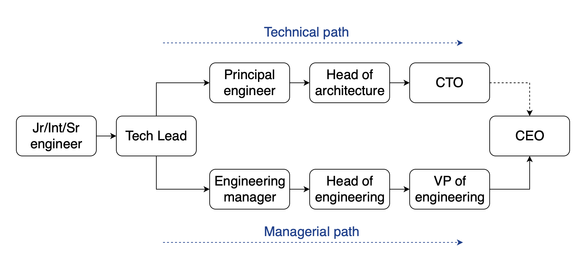

Throughout the years, a lot has been said about software engineering careers. Still, after hiring so many engineers, I find that a lot of people are confused about what a software engineering career actually looks like. Especially in the early years, when all people want is to write code.

As I'm planning to write on the topic of engineering management in this feed, I want to start with a post that goes through the roles of a software engineering function. This isn't meant as a comprehensive guide on the subject, more like a map of the territory; something I can refer to later.

I also hope it will shed some light onto the topic of software engineering career progressions for those who are at the beginning of their journey.

## A note on regionalisms and titles

Anyone who spent enough time in software engineering knows that standards is a bit of a running joke in the industry. Funnily enough the role definitions vary from a company to a company, and from a region to a region as well.

I'll try to stick to the principles and point out the differences that I know of, but just a fair warning. If some roles mean a different thing in your region, that's fine. It doesn't really mean a whole lot, it's just naming. And naming is hard.

Additionally, the situation is complicated by the fact that there is a difference between roles and titles. Often times a title might carry several roles -- like at a startup for example. And sometimes titles are given for, well, personal reasons, 
in which case the title might not actually enact the role it implies.

## The big picture

When it comes to roles and careers, regardless of a function, there are normally three categories of people that we need to keep in mind:

1. **Individual contributors** -- those who do the actual work
2. **Middle management** -- those who manage the workers
3. **Senior management** -- those who manage the managers

This is a recurring pattern in contemporary management practices and it's repeated throughout most organisations. Software engineering is not an exception. All roles in engineering organisations fall into those three categories rather distinctly.

Moreover, as one progresses in their career, a transition between those categories usually comes with a seismic shift in ones responsibilities and ways of work. All the knowledge and experience one gathered on the previous level helps as a context, but normally gets pretty useless on the next level.

## The actual picture

With all the preambles out of the way, lets look at the actual picture in the context of a software engineering team. Again, keep in mind that this is a simplified version to convey the general structure. In real life it can shrink or expand depending on the size and needs of an organisation. New titles can be introduced, or several roles might go under the same title.



I have grouped all the straight up developer roles into one box, because from the career perspective there is not much difference between them, you just get more skilled and earn a bit more salary, and that's pretty much it.

The **tech lead** role can be rather ambiguous for multiple reasons. Generally speaking it sits between the technical and managerial career tracks -- I'll get to that in a second. This is the first time a person is given responsibilities over other people, and it might or might be considered an IC role.

The **principal engineer** and **engineering manager** are considered to be part of the middle management. One focuses on technology, and the other one on people and processes. Sometimes you'd see **staff engineer** in this group as well.

The **heads of**, **VPs** and **CTO**, are part of the *senior leadership* team. Sometimes you will see **director of** in those structures, they are normally part of this team as well. But, the **director** and **VP** titles mean different things in different regions, so I'm not using directors in the diagram to make it less confusing.

## The two paths

As you have noticed, I've outlined two paths in my picture, the technical path and the management path. They are not such a clean cut in real life. You actually need a fairly large engineering team to have the split, and in a lot of cases they're glued together. But the distinction still exists and it's not a trivial one.

The problem here is that management is a discipline of its own, and a pretty complicated one at that. Being great at both technology and management is a lot to ask of a person. Even if they have the mental capacity to be great at either one of them, doing two jobs means they won't do either one well. It's often times hard to accept, especially for ex-technical people. But, unfortunately that is how this game works.

And so you have two trenches, one focuses on technology: architecture, and best practices; and the other focuses on management: people, processes, etc. They are deeply intervened, but ultimately have different goals and responsibilities. So, when you think about you career, you really need to think about what do you want to do long term, build or manage.

## The technical path

It's easy and natural to think of the technical path as the continuation of the IC technical work. All those technical roles when split out of the management path, rarely come with any actual direct reports, and seem like you're getting more and more technical.

In a way it is true, but it is also an illusion. There is an old saying in management: "as you climb up, you loose control but gain influence". The thing is that great technical work at scale doesn't happen by an accident. There is a method to the madness. It looks somewhat like this:

```
Vision -> Strategy -> Plan
```

It might sound like a whole lot of nonsense, but it's not. That's a natural process in almost every undertaking, and software engineering is not an exception to that rule. The **CTO** is expected to formulate the vision, the **head of architecture** is responsible for the technical strategy, and the **principal engineer** is responsible for producing the change management plan.

It sounds a bit like a top down approach, but in reality, in a high functioning organisation, it is a lot of back and fourth. Technical leadership is a team sport, albeit it looks like a sport that introverts would enjoy.

Let me wrap this section by saying this. If you're stepping on this path, don't expect writing a whole lot of code. Instead you will be dealing with regulatory issues, schmoosing with vendors, writing lots of documentation, and occasionally dealing with obnoxious know it all tech leads who you don't even manage. Otherwise it's a lot of fun.

## The managerial path

You know what they say, you need all sorts of people to make a team work. Unfortunately, when you get all sorts of people together in one room, all they want is to murder each other; usually mostly figuratively. That's where you need the managers, and hence the manager's track.

The management path often times called the executive track, and the reason for that is a bit complicated but also simple. CTO is rarely expected to succeed as CEO, even though they report to them. It's the VP of engineering who has the succession line to ascend as a CEO if needed. The reason being that CEO is an executive, or a manager; and CTO is not, they are a strategist. VP of engineering for all intents and purposes is an executive, they often don't even have a technical background and they usually report to the CEO in parallel with a CTO, and can step up if necessary.

I hope, now you understand the path and the dynamics in the management path. On one side you have a tech lead who don't know much of anything about management, on the other end you have a person who can run the entire organisation. That's the management track progression.

Engineering managers as a rule come from a technical background, but this rule is a fast and loose one and there are plenty of exceptions; most notably people migrating from product and operations. With heads of and VPs, there are no rules really, and both are usually very rusty when it comes to programming.

To be frank, your technical chops, or how smart you are, matters very little on this track. Your passion for people and processes, for driving the business what matters here the most. A friend of mine, and an excellent EM (call me) often jokes that his entire career is built upon a british accent and wearing glasses. And there is an element of truth to that joke, trust is a hard currency in management. And you'll need to get your act together if you want to thrive on this path.

I also think the management path has a way higher ceiling than the technical path. Both in terms of career growth as well as the pay scale

## In real life

In real life this structure can morph substantially. It is most notably affected by the size of an organisation and by the talents and inclinations of people occupying those roles. There are several notable examples of this:

Firstly, a startup. There is an old joke that a startup CTO is the most underqualified person for the job. And there is certainly a lot of truth to that joke. In a startup a CTO is a title, not really a role. Most startup CTOs basically have the role of a **tech lead**, and the org structure looks like so:

```
Developer -> CTO
```

Second example would be a growth company. Here yuu will see an actual management layer, but the technical and the managerial tracks often glued together: EM dubs as a principal engineer, HoE dubs as HoA, and the CTO dups as a VP of Engineering.

```
Developers -> EMs -> Head of Engineering -> CTO -> CEO
```

Lastly, a large corporate structure can be a bit strange as well. In this instance you would have a very layered technical track that includes principal engineers, solution architects, researchers, etc. And the managerial path would have directors and VPs.

```
Developers -> EMs -> Directors -> Heads of E -> VPs
```

Again, note that in some regions and companies, directors and VPs have the opposite meaning. Sometimes you would see a **senior** added to the titles. I even saw a HoE reporting to a HoE examples, it's all a big mess. A simpler way to look at it is this. They basically have a two stages middle management and two stages senior management structure.

The bigger the company is the harder it is to manage, and they usually end up dividing themselves into independent sub-structures with multiple CTOs/VPs.

## Final notes

Well, I hope this added some value. I'm reluctant to use the word "clarity" here, because org structures are exceptionally messy topic; especially when politics and egos start to get involved. But, I hope I have managed to explain the underlying principles a little bit.

There is a simpler way to look at this picture and that is called the "scope of responsibilities". All you need to do is to decide for yourself what is it you want to be responsible for. Is that people, technology, processes, maybe both? That will dictate the roles you're looking for, and types of organisations you want to work for.

Generally speaking though, there is just one rule. If you want to grow your career, make sure your scope of responsibilities keeps expanding. In the end of the day that what defines **seniority**, how much complexity you can be trusted to handle. And the only thing that matters in answering this question is your past experience. So, always ask for more responsibilities and deliver.
