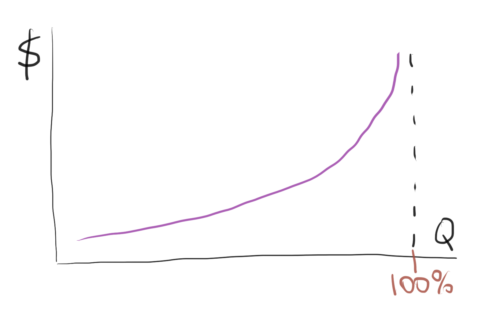
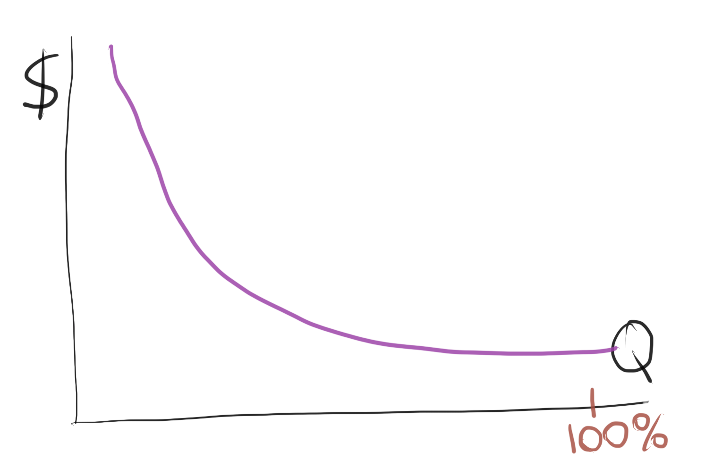
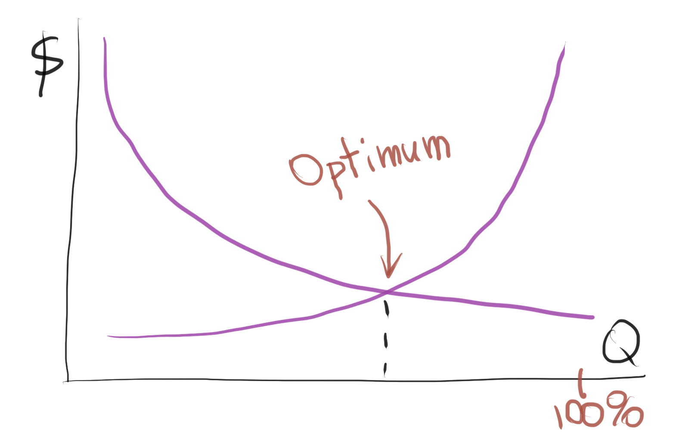
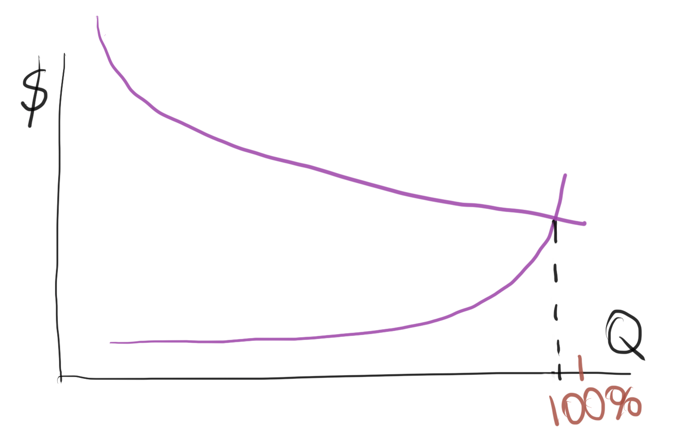

The quality of software engineering is a bit of a beaten up topic. But,
unfortunately, these conversations spend much of the time talking about
technical debt and why it's, well, bad. While that's not wrong, the subject of
quality is bit more complex than that, and today I wanted to share what I have
learned so far.

Before we start, a quick disclaimer to avoid confusion. When I say the term
"quality" here, I mean quality of a product as a whole, not just technical debt
specifically.

## The intuition

Generally speaking, most conversations about managing quality revolve around the
following intuition. The better the quality the more expensive the product is.
And the more expensive the product the less willing the customers are to pay for
it, and hence we get less customers and profits.

If we add those two ideas together then it follows that some sort of an optimum
state of ballance needs to be found between investing in quality and making
profits. Which, generally speaking, makes sense.

Here is another idea that universally accepted as something that makes sense:

> Fish rots from the head down

It sounds right and might even correlate with our experience, but it's factually
incorrect. Have you ever seen chefs picking up fish at a fish market? They
always sniff fish tails, because that's where it _actually_ starts rotting.

## The cost of quality

Quality practitioners use two terms to describe the quality management
framework:

**The cost of great quality** - defines the amount of investments necessary to
bring quality higher. Just as intuition tells us, the higher the quality the
higher the cost. But, it's not a linear relationship, it's an exponential one.
As in the initial investments buy more quality, but eventually quality stops
growing with additional spending when it starts reaching perfection.

**The cost of poor quality** - defines the amount of investments necessary to
maintain poor quality products. This includes costs such as operational costs
associated with fixes, product recalls, customer management, missed opportunity
cost, etc. Again a non-linear relationship, the initial small lapses in quality
cost less than more major quality issues. Which in extreme situations can cost
the company a business.

And so, if we put those two graphs together, we would expect to see an
intersection of the lines, and that is what our intuition tells us is the sweet
spot between cost and quality that will result in maximum profits.

And just as with the fish rotting from the head down, this seems intuitively
like a sensible idea, except it is not factually correct.

## The problem

The main fallacy here is that there is no scale to the picture. We're sort of
_expecting_ that the cost of good quality and the cost of poor quality will
revolve around the same numbers and intersect somewhere in the middle; like the
supply and demand graphs.

That is just not the cast in most situations. Most likely when put on the same
scale the combined graph would look like so:

Generally speaking the gap between the cost of good quality and the cost of poor
quality will depend on two things: production volume and margins. The higher the
production volume the higher the poor quality overheads, because one has more
customers to serve. And conversely, the lower the production margins, the lower
the cost of good quality, because the cost of quality per an additional item is
lower.

Now, if we think of an environment such as software engineering where the
production volume can count in hundreds of millions of users, and production of
an additional copy, aka margin cost, is virtually zero, it's easy to understand
that the gap between the cost of good quality and the cost of the poor quality
will be exceptionally large.

Which means that in a well functioning software engineering company there is no
really compromise to make or balance to find. The company should invest in as
much quality as it can pull off, because the cost of poor quality grossly
outweighs the cost of good quality.

## Another dimension

There is yet another dimension to this problem as well. Because quality in
products in not an uniformly distributed entity and actually has a deeper
structure. Virtually any set of features that a product has could be divided
into three categories:

1. **Baseline expectations** - people don't even think about those as features.
   For example, a car should have four fully inflated wheels and an engine.
2. **Required features** - those are the features that people usually use to
   describe a product. For example, a car should be quiet on the inside, and it
   should have a good infotainment system, and it should be comfortable for a
   family of four.
3. **Delighters** - those are the features that customers didn't ask or even
   thought about, but they enhance the value of the product in the user's eyes.
   Things like ergonomics or visual presentation would fall into this category.

This is related to quality because there are different quality expectations for
each category of features. The baseline expectations should work every single
time without a fail. For example a car must start, or a website must open up.

The required features should work most of the time as well, spared some
exceptional circumstances: like for example some parts of your application could
be unavailable due to a new deployment or a production bug. And delighters are
expected to mostly work, but if they don't it won't affect the users much: say
if the visual blings in an app stopped working for a day or two.

## In practice

So, lets quickly recap what we have gathered so far. There are two main ideas:

1. In a software product company the cost of poor quality grossly outweighs the
   cost of good quality.
2. The internal structure of product quality dictates that the baseline features
   must have great quality as a default expectation, and required features
   should follow close behind. Meaning that 95+% of any application's features
   are _expected_ to have great quality.

Both of those ideas point in the same direction, that investing in quality as
much as possible is the most sensible approach. Zero technical debt is the way
to go.

Now, I don't know about you, but I think this idea that you must invest in
quality as much as possible won't sit great with most people. Who would want to
spend all their profits on quality, right? And once again, it's just like with
the fish rotting from the head, the contradiction seems sensible, except it is
not factually correct.

When we step down to the real world practicalities, we will realise that spare
extreme cases, the quality is not capped by the amount of money a company can
pour into it, the quality is capped by the state the art of the mainstream
technology that's the company uses to create their products.

For example, the quality of cars or smartphones manufacturing is limited by the
quality of the parts manufacturing process. Similarly the quality of a web
application service is limited by the cloud infrastructure vendor's SLA, and the
security is limited by the security vendor's guarantees.

## Funding the quality

Spare some behemoth companies like Apple, Google, or Samsung that can invest in
pushing technology beyond its limits and invest in getting even better quality
of products, most companies rely on technology vendors and hence are limited by
the best practices associated with these technologies rather than money that
they can spend on quality.

Still, even best practice level product development costs money. And so, often
times the conversation goes back to the idea that quality makes products more
expensive, which in turn negatively impacts sales. So, I wanted to add a few
points to that end as well.

The most likely situation where this might be the case is really when a company
is trying to operate in an oversaturated market and doesn't segment it's
offerings well. Meaning the company competes on margins rather than product
offerings. In a narrow band of highly optimised market production costs will be
everything, and unless the company invests in cheaper manufacturing processes
they won't be able to afford quality.

That is not entirely the case in the SaaS products markets. The reason is that
the margin costs are near zero, which means that creating a 1-to-1 carbon copy
of another product will mostly produce nothing but an IP infringement law suit.

Most half-decent product strategies in the SaaS market are inherently
anticompetitive. Most successful software products operate in specific niches
and hence the cost of great quality must be priced in. Because if the quality is
not there, the company will instantly loose the bulk of it's customers to a
competitor that can make the same thing 10% better. Hence the products that
ultimately succeed have the quality baked in as a default.

## Wrapping up

There is actual science behind this madness. And if you're interested in the
actual statistical analysis and quantifiable methodology, I would strongly
recommend diving into lean six-sigma. It's not entirely software engineering,
but the thinking and methods still apply.

If you're not up for that, then here is a short wrap. As far as software
development goes, you best bet is to use existing best practice as a default
expectation. Better yet, if you have some resources to spare, investing in
discovering better than the best practice will greatly improve the bottom line
outcomes.

And conversely, operating on a level below best practice is basically throwing
the money into the wind. The main reason why situations like that exist is
because the company leadership never bothered to count the cost of poor quality,
and the expenses that go into maintaining poor quality applications largely go
unnoticed.
