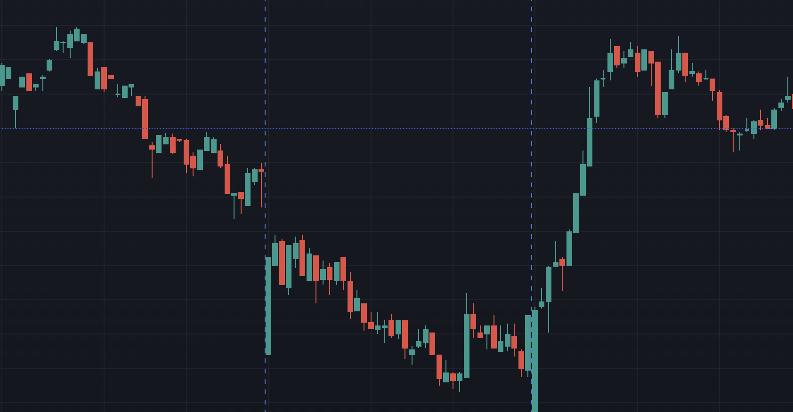

One of the key responsibilities of any manager is to manage performance of their
direct reports. Which, despite of being a seemingly obvious concept, is a
surprisingly murky subject that many managers struggle with. Often throughout
their entire careers.

I have a rather contrarian view on this subject when it comes to creative
professionals like software engineers. And today I'm trying to outline the
point.

## The price chart

I'll start with a bit of a diversion. Look at the picture below, it's a random
slice of the NASDAQ price chart.

Do you see the ups and downs, right? So... Just buy low and sell high, or buy
the dip as they say. Leverage yourself to the gills and you'll get rich in no
time. Money grow on trees, easy peasy lemon squeezy, right? Well yes, except
roughly 95% of rather smart people who try that fail. Price charts look obvious
in retrospect, but they are surprisingly hard to predict ahead of time.

The EU actually has a law that requires brokers to disclose their account
liquidation numbers. And on average, of people who try trading financial markets
for a living, 70-80% blow up their accounts within the first few months.

The point I'm making is that markets are _really_, _really_, and I mean _really_
unpredictable. And that's markets in their pure form, just money moving around.
What does it tell you about more complex situations like a startup trying to
find a market fit for their products amidst of all the complexities of running a
company?

That's right, 95% of them will fail. Not because they're run by idiots, but
because pleasing the market is a surprisingly tough gig. And anyone who tells
you that they had the right idea from the beginning and it all worked out as
expected is either a fool, or a liar. Or they are trying to sell you consultancy
services.

## Creative bottom line

At the end of the day, what matters in any organisation is the bottom line; if
that doesn't move there is no organisation, pure and simple. And when we start
talking about organisational performance, team performance, or an individual
performance, what we really want to see is their effect on the bottom line.
That's why we hire people in the first place.

This is particularly true for the creative class workers. Because it is their
creative output that has the most impact on the organisational performance in
the market. Engineers, product designers, marketers. Those are the people who
create the bulk of business value out of thin air.

Here is the problem though. If the markets are inherently unpredictable, then
how can you attach fair and quantifiable bottom line KPIs to creative work that
supposed to deliver results in those markets? Well, you really can't. Because
there is no telling what the market will do ahead of time, and the bottom line
outcomes are, at a large degree, random.

If that's not an option, then what's the next best thing? That's right, define
those KPIs as a reflection of how well a creative person "executes" on the Key
Crew vision. But then again, if 95% of very smart people fail at trading pure
price action in financial markets, then what does it say about the Key Crew
ability to predict the market fit with their vision? And so we're back to the
same problem again, trying to measure the bottom line effect from innately
unpredictable creative effort.

Success in a creative field comes from having an edge that tilts probabilities
of success in one's favour. That edge comes from experience and knowing what a
person is doing. An edge is not a guarantee though, it just allows one to stack
up their wins and losses so that they would result in a net profit long term.

## Performance management

The roots of the type of performance measurements that we're trying to use on
members of the creative class are going all the way back to the factory floors.
That's where they started to measure worker's performance and assign measurable
KPIs to their output. How many nuts and bolts they have tightened, or how much
coal have they shovelled into a furnace per hour.

Unfortunately, that is not how creative efforts work. Creative work doesn't pay
by the hour, it pays per a good market fit idea. And for every good idea there
are usually a dozen of not so great ones. Produced by exactly the same people.

And I'm talking about pure product work here, not taking into the consideration
all other organisational, logistic, compliance, and financial complexities
attached to pretty much any creative endeavour in a technology company those
days.

Measuring creative output as brickworks is just not a very smart idea.

There is one good use for bottom line KPIs based performance management in any
creative industry though, and that is to drive people out. If you really want to
get rid of a person, just put them on a performance improvement plan with
objective KPIs attached, and they will resign themselves after the first check
in.

If you like your people and would rather want to retain them, then maybe
consider doing the opposite of what makes people leave.

## The behavioural model

Fortunately, there is another way to look at this problem. And that is to use a
behavioural model. There are a few frameworks to choose from, but they all boil
down to the same point.

Seniority of a person in any field is defined by their experience. Roughly
speaking seniority represents the amount of complexity a person can be _trusted_
to deal with unassisted. Those past experiences define the person's _behaviour_,
or attitude, towards the problems they are working on.

Here is a very simple model from the adult responsibilities development theory:

- `dependant` - a person is unable to take on tasks without a supervision
- `independent` - a person can perform most tasks by themselves
- `inter-dependent` - a person is focused on leading and coaching others

Each level is defined via a person's behaviour which results in the types of
tasks they can be trusted to reliably handle. The point of this approach is that
it is the _behaviour_ of a person that dictates the outcomes, rather than skill
and knowledge. And that is a very true idea in creative professions, especially
in this day and age when knowledge has become a commodity.

And if you subscribe to the idea that it is the _behaviour_ that drives the
outcomes in a creative field, then it follows that performance management should
focus on those behaviours rather than the bottom line figures and outcomes.

## Real life examples

Let me give you a few examples that are closer to the real life situations to
give you an idea of how it looks like. I made this super simple software
engineering seniority ladder below. I have limited it to just three steps so I
could link it to the behavioural framework above.

- `junior developer` - corresponds to the **dependant**, they supposed to learn
  and ask a lot of questions,they are not supposed to commit production work
  unsupervised
- `senior engineer` - corresponds to the **independent**, meaning they supposed
  to be able to solve most technical problems unassisted
- `technical lead` - corresponds to the **inter-dependent**, they supposed to
  navigate technical decisions and coach people

Now lets look at a few situations where _behaviours_ of those engineers don't
fit the expectations based on their seniority:

- A senior engineer requires constant input and corrections to their work. Which
  means they cannot commit production work independently. Their _behaviour_
  matches the junior developer rather than a senior one
- A tech lead throws their weight around, breaks away from the team and takes on
  technical tasks independently. Their _behaviour_ reflects the **independent**
  senior engineer role rather a technical lead one
- A junior developer takes on tasks and completes them with satisfactory quality
  on their own. They can tackle the bulk of technical challenges by themselves.
  In this instance they _behave_ like an **independent** senior engineer.
- A senior engineer helps their team members to compare pros and cons of a
  technical decision, gives their opinion, and actively tries to elevate other
  members in terms of their skill and knowledge. This person is focused on the
  team **inter-dependencies** and _behaves_ like a tech lead

Here is another set of behavioural issues. Those don't represent as much of a
level mismatch, but rather point out that a correction needs to be made to help
a person to fulfil their role in a more consistent way:

- A junior engineer keeps picking up tasks way above their head and try to work
  on those independently without a guidance. In this case you might need to
  reiterate the need for focusing on learning from others.
- A senior engineer, perfectly capable of solving problems on their own,
  constantly asks for hand-holding. Looks like they need some enablement work
  done.
- A tech lead keeps trying to be the smartest person in the room without paying
  much attention to how it affects other members of the team. They probably
  could use some self-awareness and people skills coaching to overcome the
  habit.

I hope it makes more sense now, and you can see how a person's behaviour is
linked to their ability to enact each seniority level role. There is no bottom
line KPIs in here, no lines of code, no points per sprint shipped or anything
like that. And yet, this system allows us to clearly delineate performance and
seniority levels.

## Continuous performance management

One of the biggest drawbacks of a factory style management systems with
objective bottom line KPIs and annual performance reviews is the disconnection
between what a person does and what their performance review says. It's bad
enough that in creative industry a person's effort doesn't always reflect in the
marketable results. But, giving a person "quantifiable" feedback months later
when they can't even remember the details of what they did is exceptionally
counter productive to their growth and development.

In behavioural systems that approach just doesn't work. Behavioural feedback, in
order to be effective, needs to be immediate. That is especially critical when a
person is in the process of transitioning between seniority levels and not
entirely confident yet about expectations for their new role.

And in that light, the behaviour based management systems focus on what's known
as the **continuous performance management**. Which normally manifests as weekly
1-on-1s and regular coaching sessions. The idea is that rather than wait for
annual or quarterly reviews, a person receives an immediate feedback to their
behaviour; both positive and negative. Expectations are constantly reiterated
and gaps are addressed before they develop into actual problems.

This approach allows the people to reach their optimal performance levels and
become productive as quickly as possible. Which, in turn, leads to the positive
outcomes as soon as the circumstances will allow.

My personal favourite part of continuous behaviour based performance management
is that one doesn't need to wait for quarterly or annual numbers to arrive to
justify a person's promotion. As soon as a person can demonstrate behaviour
consistent with their next level, and they have skill/knowledge for it, they can
be safely promoted. This allows a company to elevate their overall seniority
levels very quickly. Which, inevitably, has a positive impact on the bottom line
deliverables. Because the more senior people are, the better the chances that
they will produce something market worthy.

## The bottom line

There is a yet another way to look at the problem, that we need to discuss,
though. Because, when we say that correct behaviour leads to positive results,
there are a few missing bits in this structure.

We can think about the problem this way. Behaviours are essentially the
pre-requisites, or leading indicators if you will. And the bottom line outcomes
are the lagging indicators. And so, we need to consider what sits in between
those two.

The right types of behaviours lead to high performance. But any type of high
performance can be aimlessly exhausted into the void without producing any
marketable results. The history of technology is littered with corpses of
companies that wasted endless years of high quality engineering efforts without
producing anything useful.

What sits between creative efforts, or energy, and the bottom line output is,
well, management. A company needs a vision, a strategy and a plan to channel
those creative efforts in the right direction. It is especially true in complex
situations with dozens of individuals involved. Without a structure there will
be no direction.

And so we're back to the same point. When we assign the bottom line KPIs to a
creative worker efforts, that seems like a good idea. But, it puts the
managerial and leadership burden on theirs shoulders. And because most employees
have no influence over their leadership's decisions, the technical term for this
is blame shifting.

## Final remarks

To be clear, I'm not against KPIs; role definitions need to be clear and
structured. I am arguing against using KPIs as a blunt tool to measure the
_output_ rather than _behaviour_; be that bottom line dollar figures or lines of
code produced.

Product adoption in the market is probabilistic. Software engineering is
probabilistic. Management is at most making the best guess with limited
information. The same exact person can work on the same exact task 5 times and
produce 5 different outcomes. In any creative endeavour there is a gap between
the person's best efforts and the final results.

The tendency for measuring the output is understandable, it is much easier to
quantify than something as fluffy as a behaviour. But having something
objectively measurable doesn't necessarily produce the true reflection of the
reality. Because every objective measurement requires an _interpretation_ to
produce meaning. And if the interpretation if flawed then so will be the
meaning.

The best predictor of a person's performance in a creative field that we know of
is their _behaviour_; or how well they enact their _role_ in an organisation.
It's not the only aspect of a role; skill and knowledge definitely have a
significant part. But, _behaviour_ plays the central role, and that what should
be primarily used as a measurement stick for one's performance.
