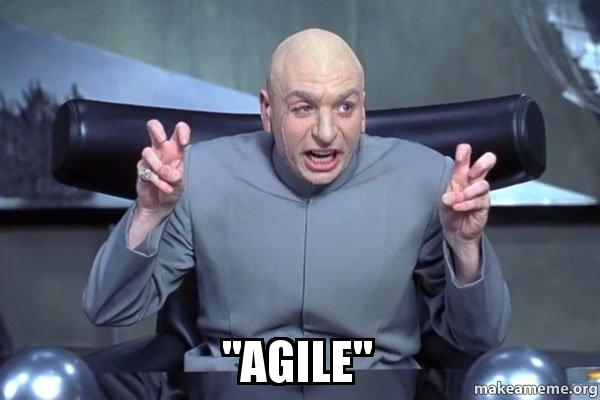
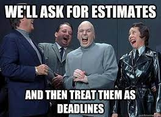

I've been through a fair bit of teams; and I have built and managed my own share
of them as well. I've seen teams that estimate in hours, I've seen teams that
estimate in points, in complexity, in t-shirts, and in pokemons. Okay, I haven't
seen teams estimating in pokemons. But, I dare to say that they'd have exactly
the same outcomes in their delivery as everyone else. Why? Well, because...

A lot has been said so far about the futility of estimations, and yet it's 2023
out there, and teams still dutifully practice the estimations drama. And so, I'm
here to "help".

## Quick math

Before you can fully understand my point, I feel it's necessary to arm you with
some knowledge. Some of you are well versed in math and statistics, and I
apologise for dragging you through this. But, some are not, and I hope you'll
find it useful.

Lets start with basic stats terminology:

- `average`, or `mean` for those in the US - means what you think it means. A
  sum of the elements divided by the number of elements. The average of `1,2,3`
  is `2`, and the average of `3,2,1` is `2` as well.

- `median` - refers to the value in the middle of a list. The median value of
  `1,2,3` is `2`. But the median of `1,1,4` is `1`, which is different from the
  average, which is still `2` in this case.

- `mode` - refers to the most commonly appearing value. The mode of `1,1,2,4` is
  `1`, and the mode of `1,2,3,3` is `3`. Obviously, there can be more than one
  mode: the list `1,1,2,3,3,4` has two modes `1` and `3`

## Quick stats

When we're talking about statistical analysis, we're normally talking about
probabilities; more specifically we're talking about probability distributions.
At which point people think about bell curves and what's known as the "normal"
distribution.

In a normal distribution, the **mean**, **median**, and **mode** mean exactly
the same thing: the peak of the bell curve. And the more difficult a problem is
the more shallow the graph will be.

A normal distribution is not the only type of distributions. Some of the most
important cases -- and estimations fall into this category -- are not bell
shaped, they are skewed and known as asymmetric distributions.

The **mean**, **median**, and the **mode** will be three different things in
this case. The reason for it is that the _area_ under the curve represents all
the possible cases, and there are more possibilities on one side of the peak
than the other.

And, while we're on the subject of weird distributions, there is yet another
probability curve to keep in mind. Sometimes, there are more than one common
outcome, and that will result in the curve having multiple bumps. Those are
called multi-modal distributions.

Those often happen in complex situations with lots of dependencies and
non-homogeneous data sources. For example, if you take the distribution of
people heights in a group that has a 1:1 ratio of males and females, you'd see
to peaks, one for the average female height and one for an average male height.

## Estimations math

When it comes to estimations, it doesn't really matter what system a team uses,
they all follow the same mathematical principles. They all go from zero to
infinity, and the probability of them being accurate can be represented by an
asymmetric, often multi-modal, probabilities distribution curve

The more complex a task is, and the more dependencies it has, the shallower the
graph will be, with more peaks showing up. At some point it gets so muddy, that
a drunk monkey throwing a banana at the chart would have roughly as much luck
with the estimation as any member of the team.

However funny that sounds, that is not the actual problem here.

## So, what's the problem?

The problem with the picture is this. When you've been asked to estimate
something, what you think about is the **mode** value, or the most commonly
appearing outcome in your experience. And the more experienced an engineer is
the more consistent they will be at pointing out the value.

But, what's really implied here is the **average** value. Because the general
mindset in estimations based planning is that you don't have to be accurate with
each estimation, the law of averages will kick in at the end of the sprint and
sort it all out. And it will. Just not the way you think it should.

What everyone is missing is the fact that in an asymmetric probabilities
distribution, the **average** is _always larger_ than the **mode** or the
**mean** value. Meaning that your averages will always be larger than your
estimations. And the more complex the task is, the bigger the gap. The work
therefore, on average, will _always_ take longer than estimated.

Yes, because the math says so.

## Accuracy and precision

When it comes to any measurement, there are two elements to the problem,
accuracy and precision; or sometimes they go by the names of bias and
variability.

- `precision` or `variability` refers to how wide spread the measurement results
  are
- `accuracy` or `bias` is how close the results are to the actual/true value

Or, in case of the probabilities distribution graph, it looks like so:

You see now, you can whip your team endlessly into "getting better at
estimations", working on optimal tasks granularity, etc. And it all will go
wrong every single time. Because you will push the team to optimise for the
**accuracy** of the **mode** value estimations; they will be aiming at the wrong
thing. And then, the team will be repeatedly punished by the high bias between
the **mode** and **average** values.

This is called a "high precision, low accuracy" situation. It's like trying to
measure the dimensions of a piece of gooie rubber with high quality calipers.

And so, what do the teams do? They pad the crap out of their estimations until
the **mode** spread overlaps with the **average** value. Everyone does this.
Either explicitly, or implicitly by using gimmicks like fibonacci numbers, and
averaging team members estimations.

Here is a fun exercise for you. Go and ask anyone on your team, including your
scrum master: "why do we use fib numbers? what's the math behind it? and what's
the point in mixing large and small numbers?". You won't hear a single coherent
thought in response. Because there is none. It's just padding, to hide the fact
that this system is inherently flawed.

## The ugly truth

The truth is that nobody knows how long work will really take. Because nobody
experienced the tail end of the distribution where the **average** lives. And
the more complex a task is, the more dependencies there are, the less
probability that _any_ estimation will be correct.

Work, especially the hard, critical work takes as long as it takes. Estimations
just lul you into the false sense of control over the situation. Nobody really
knows the answer, but when you produce a number, any number, it gives a plan a
flair of legitimacy. And off you go.

## The final chord

And that's not the worst part yet. Okay, suppose, I'm full of it. Suppose all
that math above doesn't really exist or totally wrong. Let's pretend for a
second that your estimations actually are accurate. Like for reals accurate.
What do you think is going to happen?

Suppose, you have estimated a task will take, say, **4 hours**. A PJ sandwich
falls on the jam side every other time, meaning you still have the variability
in your estimations. And, you might finish it in 2 hours, or you might finish it
in 6 with roughly the same probability (because your accuracy is great). What
happens next?

If you finish early, your manager will think you're probably not very skilled
because you had to overshoot your estimations by 100%. And if you finish late,
your manager will think you're probably not very skilled because work took 50%
longer. Either the case, they'll probably assign you to more scrum training.

You see, the thing is, even in idealised situation, you're not supposed to win
at this game no matter what. The moment you produce a number -- be that hours,
points, or pokemons -- you're screwed. Because everyone's expectations will be
anchored to the number one way or another. And it's a wrong number to begin
with.

## To a manager

Well, hello there. Since you've made it to management, chances are you're not
dumb and will be less prone to refuting factual information. So, I'll be blunt
with you here. A manager has one job, to make sure that resources are applied
optimally. And if your "management style" is rooted in estimations, you won't be
doing a stellar job at it. Here is why.

Due to the mathematical model I've described above, chances that you team's
estimations will be accurate and precise are pretty slim. The only people who
deliver their projects consistently on time and budget is the US army; and they
do that by grossly overestimating everything that moves. For a business entity
that's an F in resources allocation, which is basically your job description.

You obviously can't underestimate requirements, because that's a straight up F
in management. So, you're most likely to try pushing the team to find some form
of a reasonable middle ground. Due to the math I've described above it will fail
roughly 60% of the time. When your efforts will eventually piss off enough
senior engineers on the team, you will start paying roughly $70-100k per person
for replacements in cash money, all while delaying your project even further.
And yes, that's an F in management.

So, repeat after me "estimations is a form of budgeting". While budgeting works
great in civil engineering, it is completely counterproductive in software
development. Because software engineering is essentially a break through
development, which is creative R&D work, which is inherently unpredictable.

There are better tools to manage software development than budgeting.

## So, what now?

I imagine, you're probably sitting there by now, thinking to yourself: "well,
thanks, Kai. who do you think you are crushing my world like this?". And, look,
I'm sorry for dragging you through this, okay? If it will make you feel any
better, it pains me to write those things too; although, admittedly, I kind of
like it.

But, now you have options. You can either forget all of this and go back to
doing what you used to do. Or, you can come back in a week and read my next
story. Because there is a way out of this mess.

Yeah, I know, a shameless plug. But hey, I have mouths to feed, and I need more
eyeballs on my content. So, if you enjoyed the read, or find it useful, please
share in your circles. Thanks muchly, and I'll see you next time!
