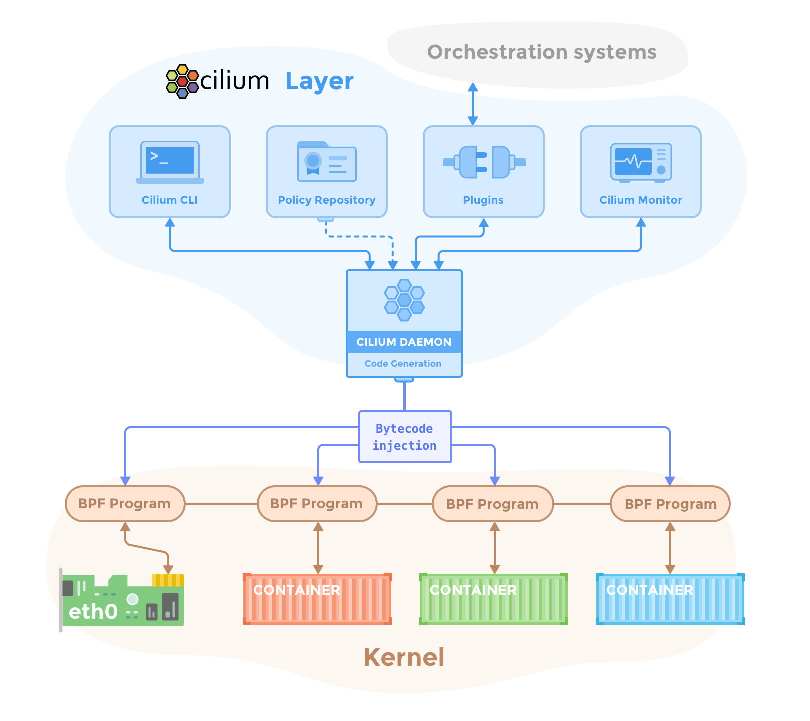

I have spent the last month and a half tinkering with [cilium](https://github.com/cilium/cilium) in my homelab. I took it through two different linux distros, four kubernetes flavours and probably a few hundreds of actual cluster deployments in various configurations. And now documenting it seems like a good idea.

## What is Cilium?

I wrote about cilium a few weeks ago when i started pocking at it. But the long story short, it is a network stack designed specifically for containerised/distributed environments. Although calling it that is probably wrong, so let me unpack it a little bit.

From the nuts and bolts perspective, cilium is basically a eBPF module that sits in linux kernel and it manages network traffic *in its entirety* between "physical" network interfaces and containers directly.

And eBPF is basically a low level bytecode VM that runs directly in the linux kernel. What it all boils down to is cilium generating that kernel bytecode from all sorts of configurations and then running the network in one place. In a way it's simple but the implications are more than significant.

## What Cilium actually do

At a first glance, what cilium does might seem counter intuitive and even anti-linux in some ways. In a "normal" linux server setup there are all sorts of moving parts to the network stack: iptables, netstat, firewalls, etc. And then when we add containers into the mix there is the containers networking interfaces (CNI). And in case of Kubernetes there is also cluster routing, RBACs, proxying, and more. And on top of that, you might be looking at cross-cluster meshes and what's not.

Cilium aims to basically replace all of that with just one piece of software, one kernel module. It wants to own the entire network stack from L2 to L7 and everything in between; including your host network management and the firewall. It's like one monolithic tool that does it all. And that's what i meant when i said that it seems a bit anti-unix from a philosophical perspective.

And so, the question that kept bugging me at the beginning was *"why would you want to do that?"* why move away from a set of small well tested and replaceable tools to a monolith? And more importantly why would you want to manage the _host network from a container?_ shouldn't it be the other way around?

## The rationale behind Cilium

There are definitely network performance improvements by handling everything in one place. There are no handovers and everything runs in the kernel. In a large, facebook scale deployments that is probably significant, but in a homelab context it won't even register.

There is also the appeal of having one tool for everything. And that what had initially drawn me to cilium. Being able to setup everything from L2 IP announcements to L7 ingress routing in one tool seemed neat and appealing. But, in practical terms it doesn't make a whole lot of difference in the day to day. Because although cilium is what powers your manifests in the background, these are still the same exact kubernetes standard manifests. And from that perspective its as good as any other tool.

As obvious as these points are, I think they are the wrong lens to look at it though. I think the better way to look at cilium is large scale fully containerised environments. As in hundreds of nodes per cluster that run nothing but containers.

I think in the context of a "traditional" somewhat manually built small app server there is not much of a difference between using more "normal" tools and cilium. You'll just swap one type of configs to another.

In a large container first environment though, it makes a whole lot of sense to have the entirety of the network stack to come from control plane and be observable through and through in one place. It is definitely possible to automate iptables, firewalls, and all in a 1000 nodes cluster through something like terraform, but it won't be as robust and manageable as a centralised cilium based network management.

And from that perspective of large scale cloud networks engineering I think cilium is actually quite spectacular.

## What was my experience like?

In the past 6 weeks or so, I installed cilium in all sorts of setups. Ubuntu, and fedora server. Vanilla k8s, k3s, k0s, microk8s. Normal HTTP/s apps, tcp workloads, network security roles, host firewalls, l2 ARP net IP announcements, everything I could figure how to work with.

And in most cases it just works. It is shipped as a helm chart, and the installation process is mostly straight forward actually. The most complicated part was stripping down kubernetes itself to remove cluster routing, CNI, kube-proxy and all of that, and in different kubernetes distributions it can be a little tricky to achieve.

Cilium also comes with very good observability tooling and a simple UI where one can see visually how everything is tied together and observe the traffic and API calls; which is fantastic. The Prometheus/Graphana integration is top notch too.

It definitely becomes a bit complicated if you try to mix and match things with cilium. Like for example trying to pair it with host firewall took me onto all sorts of spelunking journeys.

Also I have experienced issues with L2 IP announcements and leases which was less than ideal. But these are _me_ problems, i think more experienced engineers would have less of an issue with these.

## Why I moved away from it

Eventually though, I actually decided against cilium and went back to a more standard metallb, flannel, and traefik setup. And the reason has less to do with cilium and more to do with what I need.

The thing about cilium is that it is designed for cloud network engineers, and I'm not that. I'm mostly an app developer, and i only pretend play a sys admin. Cilium does everything up to the app level very well, and even though it has all the standard ingress and port mapping implemented, it is much less useful to me than traefik for example.

I have no interest in setting up network traffic policies and write hundreds of lines of firewall manifests to secure my cluster. Those are all cool things to work with, but what i need is different. I need reusable middleware to authenticate and redirect and whitelist http calls. I need simple traffic routing tools so i could connect IPs to services. More specifically I work with TCP/UDP protocols a fair bit, and cilium doesn't support TCP routing and I'd have to stick to vanilla loadbalancers or node ports for those.

I have a history of maintaining and troubleshooting metallb and traefik setups. And cilium doesn't actually add a whole lot for me personally (although I really like hubble UI), if anything it subtracts from what traefik can offer.

Well that, and issues with L2 announcements stability, is what led me back to a familiar setup.

## Take away

I really like Cilium, the idea of it, and the tools like hubble UI. And if i was running a proper production multi-tenant cluster, i'd even consider it as an option. But I don't and so I didn't.

Still, I have my reservations about the way they're approaching the market. Networking is a hard problem and there is a reason why we have so much various tooling for different tasks. And if cilium aims to own everything it's going to be difficult for it to compete with _everything_ else. I don't think that is sustainable.

Traefik vs Cilium is a good example here. Traefik is great from the app development perspective because it has a familiar and extensible middleware based architecture; where cilium is putting its bets with kubernetes native standards that naturally tend to lag behind the real world use cases. For example there is still no implemented concept of TCP routing in cilium. And so we're almost looking at having both to get somewhere, but then it goes against the grain with Cilium "own everything in one place" ethos.

And i think this tension will continue hinder Cilium's progress and adoption.

Or. I'm wrong about all of this. And in that case we're all going to benefit from cilium's success.

