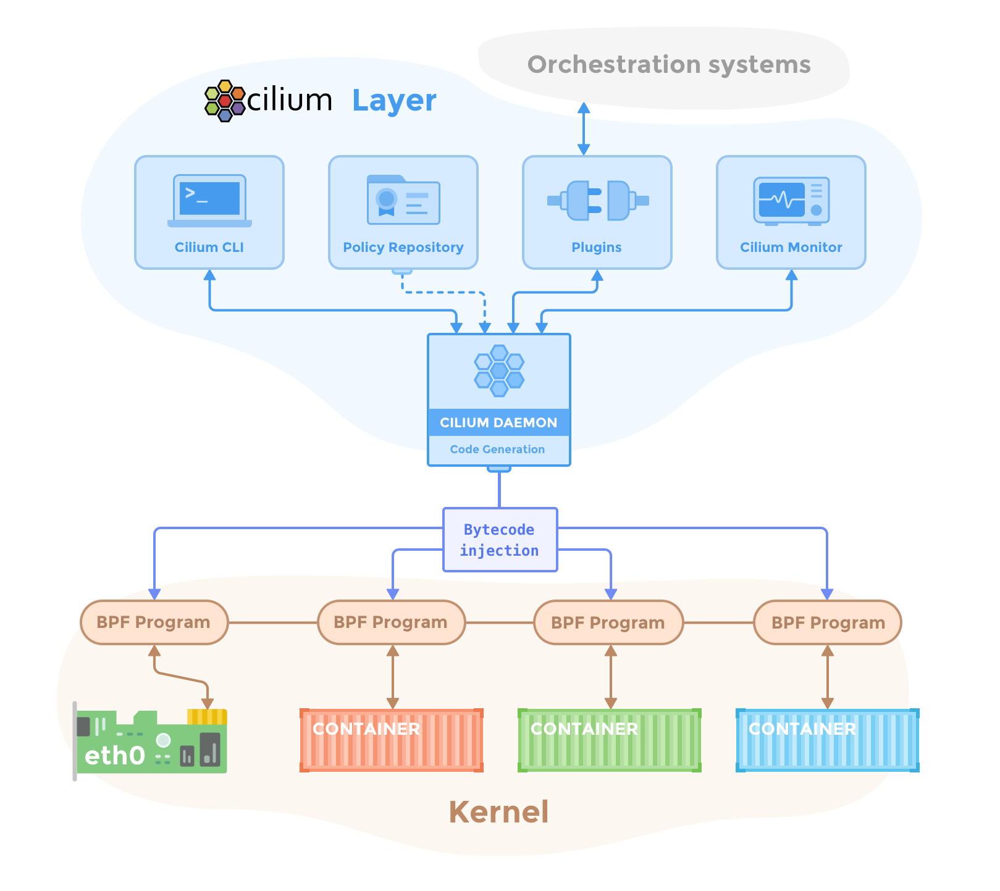

# Cilium vs. the world

I recently learned about the [cilium project](https://github.com/cilium/cilium). I've spent a few weeks working with it and somehow ended up using it as a default in my homelab setup. This article is basically capturing that experience before i forgot everything.

## What kubernetes network layer is made of?

For an average kubernetes user the network layer is probably the least interesting part of the setup. People are mostly preoccupy with the manifests and deploying apps. But, it is actually the networking layer that makes most of the magic work. And from the systems administration perspective it's actually a pretty complex and cool topic.

Generally speaking there are the following elements at play in a kubernetes cluster. Well, the ones I know off anyways.

* `kube-proxy` - handles network traffic between pods
* `kube-router` - knows where everything is connected and routes traffic
* `ingress controller` - directs external traffic on HTTP/S ports to services
* `gateway controller` - it's like ingress controller but also can handle TCP traffic
* `service load balancer`  - to load balance internal traffic to pods under a service
* `external ip address pools` - tracks external IP addresses allocations from IPs pools
* `l2 announcer` - manages L2 ARP net external IPs advertisement
* `BGP support` - manages cluster level load balancing between nodes
* `network policies manager` - for L3-L6 network policies

On top of that you have the host/kernel elements

* `netsat` - kernel stuff
* `iptables` - kernel/firewall stuff
* probably more OS level firewall stuff

Oh and if that's not enough, there is also cross cluster VPC mesh magic stuff. And there is probably even more stuff, I mean I'm not a real sys admin after all and you'll have to forgive me the somewhat watered down description of the system.

My point is that there is a lot that goes into making a kubes cluster magically work, and in a normal setup, there are several independent sub-systems that work together to make it work.

## So what about Cilium?

Cilium as a relatively new project. Long story short it basically throws away everything that I have listed above and replaces it with, well, itself. It is specifically developed for modern kubernetes cluster deployments and aims to replace the jumble of all the parts and manage network by itself in one place.

A particularly cool thing about Cilium is that it runs directly in the kernel. Well, in a kernel level VM to be more specifically as a eBPF module. On one side it talks to the kernel network interfaces, on the other it talks directly to pods in kubernetes.

This approach has quite a few advantages. There is definitely performance improvements, due to better traffic routing and less handover overheads, which probably don't really apply to us mortals but still an improvement. There is also enhanced security as all the traffic goes through a single chock point. But, you also have more everyday life improvements too, like for example a pod can now see the original caller IPs, there are options to spawn either shared or isolated loadbalancers and ingress controllers at low cost, and just being able to manage all the traffic rules in one place.

## What does it look like in practical terms?

The whole thing is written in Go and distributed as a regular Helm actually. You just add a few lines into a config and install it as any other kubernetes extension. It's actually very straight forward in this regard.

The more annoying part is actually the fact that you'll need to disable a bunch of things in kubernetes itself. Most of the actually cool Cilium's features won't even work unless it takes over from kube-proxy. And that's where things get kinda messy.

If you're dealing with a regular k8s/k0s deployment where all components are split apart, disabling them is not all that complicated. But, when you start looking at more opinionatedly packaged kubernetes variants like k3s and microk8s it gets dicey.

In k3s one can disable kube-proxy, well it's actually runs flanneld and traefik as opinionated defaults to handle cluster network. You can disable those too, but the problem is that a lot of k3s standard configs would use vendor specific features, where cilium aims more at kubernetes native standards and translation might not always be easy or obvious.

In microk8s everything is baked into a single binary, and as far as I could find there is no way to run a kube-proxy replacement because it's baked into the binary. I have managed to make some of the Cilium features operational, but in the end couldn't produce a fully working solution. It is definitely a me problem, I'm just saying that things get complicated in more opinionated setups.

## So, how do I feel about it?

To tell you the truth, I'm a bit of a sucker for neat solutions like that. And I'm running it on my setup as I'm writing those words. It has all telemetry and prometheus integrations throughout the stack, which is great. And it even has a neat little UI where I can see a network diagram, how everything is wired together, what talks to what, and see the call logs.

And yet it leaves this weird uneasy feeling about it. I've spent my entire career with iptables and netstat and ngnix proxy and metal-lb and traefik. And now this thing basically replaces _everything_!

There is definitely a bit of learning curve, but thanks god Cilium authors approach it as basically a drop-in replacement, so all the familiar concepts are still in place, and they heavily lean on kubernetes existing standards and ways to define stacks. So everything makes sense and has a certain familiarity to it.

And it actually works too. It just boots and does it's thing when setup properly. I've re-installed it different ways a few dozens of times within the last three weeks, and it just keeps ticking. Although I think I'll definitely need to observe it on a longer scale to really trust it. It's too much of a change in one go for my taste.

On one hand it's a very interesting leap, and I even like it's all-in-one design. On the other hand it doesn't really provide anything for an average homelaber that the standard bag of tools wouldn't do. 

So, I don't know how I feel about it yet. But, I'll definitely keep running it for a bit. It's interesting, that much I'll give it.

