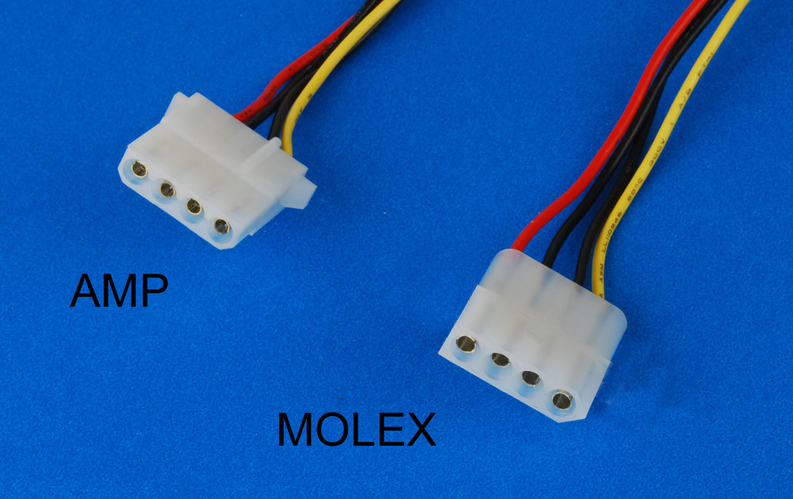
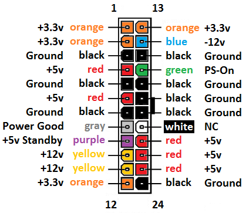

When people see this picture of a custom 24-pin power cable I made to power three motherboards off one PSU, the reaction I normally get goes something like this:

> WTF Kai, you can't do this! It will blow up!

And so here is a little story of why and how.
## The brief history of the Molex connector

Anyone who ever worked with PC hardware saw Molex connectors. That's the wiring that goes from a PSU to a motherboard. The 24-pin motherboard and 8-pin CPU power cables are as ubiquitous as they come. But do you know where they come from?

Well, you see, Molex LLC was founded in 1938 and began its history by making flower pots out of plastic that was made of leftover asbestos shreds, coal tar, and limestone. They called the plastic Molex. They also made salt shakers out of the stuff apparently.

In 1950s they ventured into electronics and patented the 4-pin Molex connector which became ubiquitous in all sorts of electronics. It wasn't actually made of Molex but white nylon that everybody knows to the day

It was hugely popular in all sorts of electronics, appliances, cars manufacturing. And then it became the standard for all the PC hardware. All those old 5-inch and later 3-inch slots on PCs used to be powered by those 4-pin AMP connectors.

Later, the use was expanded to 24-pin connectors; which are still almost in every car and motherboard on the planet. With the advent of more power hungry CPUs we added the 4+4 CPU power cable. And when we started making those crazy GPUs we started using the same thing for all sorts PCIe power cables too.
## How does it work?

Why the history lesson? Well, you see, those connectors didn't actually get any smarter since the days when we used to make salt shakers out of asbestos that held together by coal tar. These are mostly just dumb wires.

Most of the PSUs are still mostly dumb too. I mean, up to the very recent times they didn't even use GaN MOSFETs in them. And, the wast majority of PSUs still have a single power rail. The real reason we have those many wires going from a PSU to a motherboard is not because we need that many actual wires but because those connectors suck. We have a whole bunch of them running in parallel so they wouldn't melt.

Here is the 24-pin motherboard connector schematics for example. Do you see all those duplicate wires? That's what i'm talking about. The only "smart" wire here is that green `PS_ON` pin. More on that in a second.

What I want you to understand is that this all is still 1950s era tech that is like QWERTY and skewed keyboards just stuck around for whatever reason. And these PSUs themselves has no idea what's actually connected on the other side of that cable. It doesn't have any concept of the number of devices connected to them either.

The way it works is that when you connect that green `PS_ON` wire to `GND` -- that's where your power button is basically connected -- it tells the PSU to switch from a standby mode to normal power delivery and start feeding energy into the cable.

When you ground that wire one more time, it will wait for the computer to stop sucking the energy aka shutdown and then it will go into a standby mode.

And that's it. There is nothing else going on in the whole power delivery system in a PC.

## So what happens in a splitter?

Well, okay, first of all, I lied when I said that the power button connected to `PS_ON`, it's a bit more complicated than that, but not by much. Basically starting a CPU is a two step process: step one power it up, step two kick off the ticker. The reason for that is that power doesn't just magically appears everywhere when PSU turns ON, there are delays and spikes in energy delivery and hardware will wait until its fully powered before it kicks off the CPU. And that's what the power button does.

And so, if we have 2+ motherboards connected in parallel here is what happens. When you press the power button on the first motherboard, it will power up _all_ the motherboards at the same time, and then it will boot _only_ the motherboard which button you pressed. All the other motherboards will be powered but won't actually started.

After that you can press power buttons on other motherboards one by one and they will start as normal. They'll just skip the power on process because they will already be under power.

Powering them down works basically in reverse. When you press the power button it will send a signal to PSU to wait for the motherboard to shutdown and then go into standby. That signal can be sent multiple times from each motherboard. PSU will just wait until the last motherboard shuts down and then turn itself off.

It feels almost like three separate PCs, no matter the fact that they are powered by a single PSU under the hood. And considering that this is a 24/7 homelab server, i don't even have to do that unless I'm pulling the thing apart for upgrades or what's not.

## Playing with fire

Okay lets make something clear here, I've made my share of all sorts of cables, but I'm not a god of cabling or anything like that. If anything my crimpling skills are probably average at best. And so when we're connecting something to a 1000W PSU we probably need to think twice about the loads and such. Because that's about 1.25 horse powers in real terms, and this PSU could probably bench press half a dozen average software engineers if it really wanted to.

Most power cables in a PC made of 18 gauge copper wire, which is good for about 5A of current. That's about 15 Watts per 3V wire, or 25 Watts per a 5V wire, or 60W per a 12V wire. A normal CPU connector runs 4x12V wires, which equals to about 240W of energy. Plus the 24-pin connector wiring can carry about 300W.

Even one of the beefiest consumer grade CPUs like AMD 9800X3D CPU has 120W TDP. And so, what I'm saying here is that the wires themselves in those setups are rarely the problem. The problem is the connector itself. If the crimpling is done more or less well, the only part that matters is the overall load on the wiring. More specifically on the CPU part of it, because the motherboard doesn't consume nowhere near that amount of energy in normal circumstances.

If I needed to connect three 9800X3Ds to the same PSU I would probably consider connecting them with separate wires to the PSU and use a shared 24-pin cable for the motherboards. But, in my case I'm dealing with AMD 7945HX CPUs which are laptop CPUs factory overclocked to max 80W TDP.

Even at the full blast that will be 3x80=240Watts total, which is well within the capacity of a good quality 18 gauge wire, and there are still three independent connectors to carry tho loads as usual. Moreover in my case, the first leg of the cable is actually made of slightly thicker 16 gauge wire rated to 7 Amps which makes it good to carry up to 330W of energy.

And so, unless I have majorly screwed up wire crimpling this should be fine in my case.

## I wish...

I'll be honest with you, in the days of ubiquitous smart and super efficient GaN charges, and USB-C 3.1 PD protocols that can deliver up to 240W continuously via an USB-C connector, having those Molex plugs made with a hammer and sickle feels weirdly out of place.

PC PSUs are mostly inferior in terms to efficiency comparing to GaN MOSFETs, and they're bulky and mostly empty too actually.

And I can't help but wish they'd just be done with those Molex connectors nonsense and just have USB-Cs for everything. Get rid of the 4 pin fan connectors, and front panel pins, and USB-A breakouts, and ethernet ports; everything. Just add a bunch of USB-Cs everywhere. 

Why do we need all that 1950s era nonsense in 2025? Wifi 6E routinely pushes over 5Gbs, and usb-c 4 can get 40Gbs of data through while delivering 240W of energy. On the same cable!

Because trust me, I don't want to hand make custom power cables so I could plug a bunch of stuff to the same power block. This is just dumb.